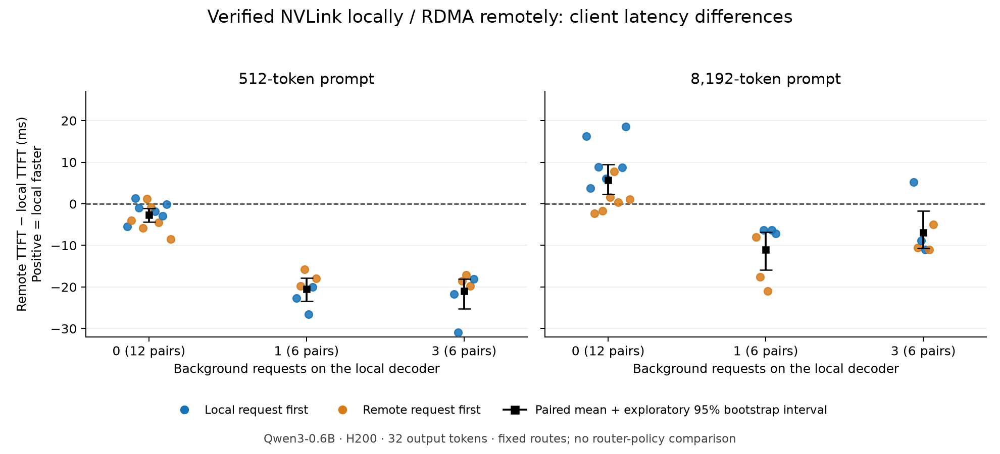

# Verified local NVLink and remote RDMA: paired client timings

**The transport gate and full timing block passed.** Real llm-d sidecar P/D requests used CUDA IPC/NVLink locally and RDMA remotely, with 32 qualification requests, eight matching cases across four routes, 96 timed foreground requests and 48 complete pairs. Transfer errors remained zero. Gold-answer accuracy was 16/32 and is reported separately from the approved direct-versus-P/D output-parity criterion.

At idle, local decode was modestly faster for 8192-token prompts; remote was slightly faster for 512-token prompts. With one or three concurrent requests on the local decoder, remote was generally faster for both prompt sizes. This establishes a locality/load tradeoff in this small-model fixture. **It does not establish an improvement from our router filter or a need for prompt-dependent allowances.**

All resources were independently verified deleted at 2026-09-21 02:55:50 UTC (September 20 Toronto). Temporary administrator access was revoked and verified absent. Successful run **$16.10**; overnight work **$25.75**, including **$9.65** in failed setup attempts. **$23.08 remains** under the cumulative evaluation cap. These are conservative estimates before tax, not invoice totals.

## Results

TTFT means client HTTP-request start to the first nonempty generated text fragment. Every foreground request generated 32 tokens. Medians below describe each route; the final column averages the differences within matched pairs. Positive differences favour local decode.

| Local background requests | Prompt tokens | Complete pairs | Local median TTFT (ms) | Remote median TTFT (ms) | Mean paired remote − local (ms) |
|---:|---:|---:|---:|---:|---:|
|0|512|12|51.3|49.0|−2.7|
|0|8192|12|94.5|98.8|+5.7|
|1|512|6|74.1|53.7|−20.5|
|1|8192|6|115.1|105.4|−11.1|
|3|512|6|74.1|53.8|−21.0|
|3|8192|6|112.1|104.1|−6.9|



The idle long-prompt advantage appeared in 10/12 pairs, but its size depended on route order: mean 10.4 ms when local was first versus 1.1 ms when remote was first. Repeat that modest effect before calibrating a routing threshold. The plotted intervals are exploratory paired bootstraps from a small sample, not a production guarantee or tail-latency result. No request or pair was removed or replaced.

## What ran

Two eight-H200 spot hosts on the same Nebius InfiniBand fabric, with 16 GPUs billed and three used. One shared two-GPU container ran the prefill and local decode processes; a separate host ran the remote decoder. A CPU node ran the client. This shared-container arrangement is the verified local recipe; it does not establish CUDA IPC between ordinary isolated one-GPU Pods.

Qwen3-0.6B revision `c1899de289a04d12100db370d81485cdf75e47ca`; pinned vLLM 0.26.0 and llm-d sidecar 0.10.0 images; BF16, tensor parallelism 1, eager execution, block 64, max sequence length 16384, max active sequences 4, max batched tokens 8192, GPU memory utilization 0.2, prefix caching disabled. Both hosts allowed UCX to choose from all available transports. No local-versus-remote transport restriction or CUDA-IPC GET override was added.

The eight fixed copy/retrieval cases were executed through direct-local, direct-remote, P/D-local and P/D-remote routes. Then two warmups per prompt-size/route combination preceded 12 low-load pairs per size and six pairs per size at each loaded level. Route order was balanced and randomized with a frozen seed. Each foreground pair used identical token-ID input and generation settings.

The loaded cases started a fresh cohort of one or three direct-local requests (512 input tokens, 1024 output tokens) before each foreground request. The engine's active-request count had to reach the requested level; it remained at or above that level in the saved before/after observations, and every background request remained unfinished until the foreground completed. These are controlled local-load probes, not a steady-state production traffic mix. The background workloads include their own prefill. In total the client sent 232 calls: 32 qualification, eight warmup, 96 measured foreground and 96 background requests.

## Evidence and checks

- Three distinct physical GPU UUIDs and stable GPU process identities from start through completion.
- Local topology NV18; idle/direct/remote controls moved no data between the two local GPUs during qualification.
- Each local P/D qualification request moved NVLink bytes matching its KV payload, within the predefined integer-counter rounding bound: 56 MiB for 512-token prompts and 896 MiB for 8192-token prompts.
- Actual GPU-memory READ protocol tables selected CUDA IPC locally and RDMA remotely. Available-transport listings were not accepted as proof.
- Exactly one transfer on the selected decoder and none on the other workers for each P/D request, with unchanged failure counters. 120 KV transfers overall.
- All 32 qualification responses had the expected token counts; each of eight cases matched across all four routes. Gold 16/32 is not claimed as perfect semantic accuracy.
- All 96 measured streams completed with correct input/output token counts. Every request matched the frozen plan and every pair followed its planned route order. Background token counts and observed load were independently rechecked.
- An early artifact backup was taken during the first loaded block; the final archive contains the complete run. Independent validation of the final archive passed with no incomplete pairs.

## What this does—and does not—justify

We now have evidence for the basic premise: keeping decode local can reduce client latency for a longer prompt, and extra local work can outweigh that advantage. Client TTFT includes prefill, transfer, scheduling and network/control overhead; this experiment does not isolate a raw KV-transfer bandwidth effect.

At the tested loads, remote was generally preferable for both prompt sizes once any background work was present. Therefore these observations **do not yet establish different optimal integer allowances for the two prompt ranges**. Do not choose two allowance values merely to preserve the original project plan.

The EPP and proposed filter were not in this forced-route experiment. Hard locality, unrestricted routing, tuned soft scoring and the proposed gate have not been compared here. A larger model, multiple local decoders and a representative placement remain separate decisions; no further rental or redesign is implied by this result.

## Reproduction and artifacts

`summary.json` and `paired-ttft.csv` contain all 48 pairs, route order and exploratory intervals. The three compressed evidence archives preserve client requests/responses, the frozen timing plan, per-request engine counters, protocol logs and GPU evidence. `engine-manifest.json`, `client-endpoints.json`, `provenance.json` and `preflight.json` record the deployed configuration and source checks. `plot.py` recreates the figure with matplotlib.

From the repository root, extract `client-evidence.tar.gz` into an empty temporary directory, then run:

```sh
python3 infra/topology/summarize-paired-hosts.py \
  --folder /path/to/extracted-client-evidence \
  --suite workloads/paired-locality/suite.json \
  --out /path/to/rechecked-summary.json
```

The preparatory failures are retained separately: [permission gate](../2026-09-20-paired-preflight/RESULT.md), [CPU readiness timeout](../2026-09-20-paired-readiness/RESULT.md), [ConfigMap packaging error and stronger preflight](../2026-09-20-paired-packaging/RESULT.md). No source or results were pushed, and the upstream PR was unchanged.
