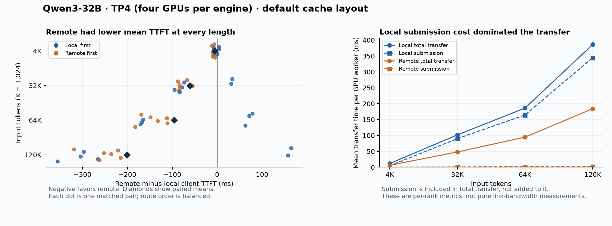

# TP4 locality measurements: local submission cost dominates the default layout

**The complete real-model screen ran at TP4 (four GPUs per serving instance):** 32 qualification requests, 16 warmups and 96 timed requests in 48 matched pairs. All eight cases matched across direct-local, direct-remote, P/D-local and P/D-remote routes; source-location gold accuracy was 28/32 and is separate. All four local receiving ranks (GPU workers) selected CUDA IPC, and all four remote receiving ranks selected RDMA. The screen recorded 512 rank transfers and 1,760 GiB of KV payload, with no transfer errors.

**Remote time to first token (TTFT) was lower on average at every input length.** The detailed metrics locate a large difference in transfer submission, rather than prefill computation. Local transfers were fast when described by few memory segments and slow when described by many. No routing-policy improvement or useful allowance has been established.

All paid resources were independently verified deleted at **2026-09-21 20:38:23 UTC**; temporary project-admin access was revoked. The successful run cost **$31.63**. All September 21 attempts cost **$57.05**, bringing router-project cloud spend to **$182.48** and leaving **$42.95** of the authorized session allowance. Estimates are before tax, not reconciled invoices; totals use unrounded values.

## Client latency

TTFT is HTTP-request start to the first nonempty generated text fragment. Each timed request generated exactly 32 tokens. K means 1,024 input tokens; 120K is 122,880, with output headroom below 131,072 total context.

| Input | Pairs | Local median TTFT | Remote median TTFT | Mean paired remote minus local | Local faster pairs |
|---|---:|---:|---:|---:|---:|
| 4K | 12 | 182.96 ms | 175.01 ms | −5.47 ms | 3/12 |
| 32K | 12 | 1,736.86 ms | 1,657.40 ms | −60.58 ms | 2/12 |
| 64K | 12 | 4,441.45 ms | 4,295.42 ms | −95.45 ms | 3/12 |
| 120K | 12 | 11,598.29 ms | 11,316.47 ms | −200.50 ms | 2/12 |



The mean paired difference favored remote in all three blocks at every length, and in both route-order groups. Its magnitude remained order-sensitive; at 120K the mean was −150 ms with local first and −251 ms with remote first. `uncertainty.json` preserves exploratory paired-bootstrap intervals and block means. Twelve pairs in one deployment are not broad production replication or evidence about tail latency.

## The useful diagnostic: segment count and submission cost

A transfer descriptor identifies a memory segment to copy. The same payload can require very different descriptor counts depending on the physical arrangement of its cache blocks.

For 120K requests, the aggregate payload was always **30 GiB**, or **7.5 GiB per TP rank**:

| Route | Observed descriptors per rank | Requests | Mean submission time per rank | Mean total transfer time per rank |
|---|---:|---:|---:|---:|
| Local | 64 | 2 | 0.66 ms | **23.15 ms** |
| Local | 122,880 | 10 | 413.31 ms | **458.63 ms** |
| Remote | 64 | 4 | 0.10 ms | 225.76 ms |
| Remote | 122,880 | 8 | 3.17 ms | 163.21 ms |

Across all input lengths, **all ten local-winning pairs were the ten local requests with 64 descriptors**. This is an exploratory association in the completed run, not a randomized cache-layout ablation. No request was removed, replaced or selected for publication based on its result.

All 24 few-descriptor requests, counting both routes, occurred first within their pair. Descriptor state and route order are therefore associated in this run. Balanced route order did not hold memory-layout state fixed; the averages describe this request sequence and deployment, not a context-independent property of either link.

Averaged across all 120K requests, local submission took 344.53 ms versus 2.14 ms remotely; total transfer took 386.05 ms versus 184.06 ms. Prefill computation was nearly identical: 10,875.69 ms locally routed versus 10,878.34 ms remotely routed. The measured transfer-stage difference closely tracks the client TTFT difference.

**Working interpretation:** the local submission path is highly sensitive to the many-segment case. This explains why increasing input length alone did not produce a reliable locality benefit in this configuration. It does not show that NVLink hardware is slower than RDMA. The precise allocation/coalescing mechanism and posting implementation still need a controlled test or profiling.

NIXL transfer duration includes posting. Copies may overlap submission, so subtracting posting time does not yield a pure data-movement time or link bandwidth. These metrics are averages over four rank transfers, not the measured critical path of the whole TP group. [Pinned vLLM metric definitions](https://github.com/vllm-project/vllm/blob/v0.26.0/docs/features/nixl_connector_usage.md#metrics-reference)

## Configuration and method

- Two eight-H200 preemptible (spot) hosts on one InfiniBand fabric, with 16 GPUs billed and 12 used. Node A ran TP4 prefill and TP4 local decode in disjoint GPU groups within one shared container. Node B ran one TP4 remote decoder. A separate CPU node ran the client.
- Qwen3-32B revision `9216db5781bf21249d130ec9da846c4624c16137`; pinned vLLM 0.26.0 and llm-d sidecar 0.10.0 images. BF16, fixed YaRN scaling, 131,072 total context, eight sequences, 8,192 batched tokens, block size 64, memory fraction 0.85, chunked prefill and default graph execution. Prefix caching was disabled. Effective attention backend: FLASH_ATTN; KV layout: HND (cache data grouped by attention head); cross-layer blocks disabled by default.
- Eight frozen code-reading cases from a pinned public llm-d-router snapshot: two questions at each length. No repeated filler was needed. The complete token-ID requests, source license and configuration are included.
- Local qualification passed before remote allocation. Remote qualification passed before warmups and timing. Each length had twelve pairs across three blocks, with balanced randomized route order per block. No local or remote background load was introduced.
- Every measured stream had the expected input/output counts and its prescribed route/order. Saved per-request metric deltas identify the selected decoder, four rank transfers, expected KV bytes and unchanged error counters. GPU identities remained stable.

## Next experiment, not yet executed

The pinned vLLM release documents `enable_cross_layers_blocks`, disabled by default, to make each logical cache block contiguous across layers and reduce transfer buffers. Its connector supports this option with the FLASH_ATTN/HND combination used here. [Versioned guide](https://github.com/vllm-project/vllm/blob/v0.26.0/docs/features/nixl_connector_usage.md#cross-layers-blocks), [support conditions](https://github.com/vllm-project/vllm/blob/v0.26.0/vllm/distributed/kv_transfer/kv_connector/v1/nixl/connector.py)

The next useful test is a bounded, matched comparison of the default and packed block layouts, configured consistently on prefill and both decoders. Verify correctness, actual layout, descriptor counts, submission/transfer times and client latency. The option is a candidate remedy, not a measured fix. Do not attribute its possible benefit to the proposed router filter.

No EPP policy comparison, live concurrency sweep, allowance calibration or prompt-dependent routing benefit has been measured. The serving baseline should be reviewed before those steps. The earlier 0.6B and RDMA-only 8B runs use different configurations and are not pooled with these results.

## Artifacts and reproduction

`summary.json`, `pairs.csv`, `uncertainty.json` and `component-analysis.json` contain the derived measurements. The three evidence archives preserve client streams, per-request counters, GPU/rank identities and protocol logs. Configuration, exact frozen requests, manifests and cost/cleanup records are included. `plot.py` reproduces the figure with matplotlib.

Extract `client-evidence.tar.gz` into a new folder and run from the repository root:

```sh
python3 infra/topology/summarize-tp4.py --folder EXTRACTED_CLIENT \
  --suite results/2026-09-21-tp4-locality/suite.json.gz --out summary.json
python3 infra/topology/analyze-tp4-components.py --folder EXTRACTED_CLIENT \
  --out component-analysis.json
```

The preceding [CLI startup failure](../2026-09-21-tp4-startup/RESULT.md), [capacity rejection](../2026-09-21-tp4-placement/RESULT.md) and [local-only qualification stopped by a remote startup-health flag](../2026-09-21-tp4-local/RESULT.md) remain separate records. Source, results and documentation are committed locally; no PR update or public push is implied.
